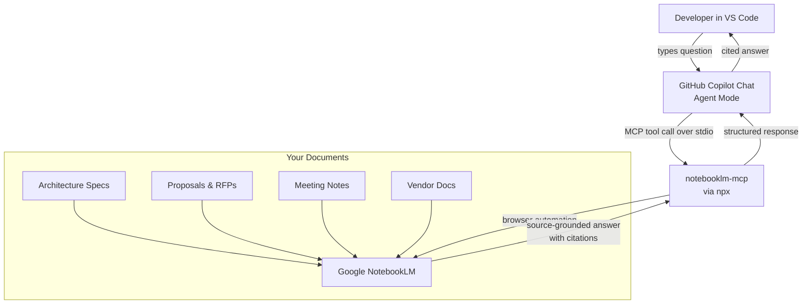

# NotebookLM + GitHub Copilot + MCP

> **GitHub Copilot + NotebookLM + MCP = grounded AI engineering inside VS Code.**

Turn GitHub Copilot into a source-grounded AI engineering agent using NotebookLM + MCP. Stop hallucinating architecture. Start citing documents.

[](https://github.com/davidop/notebooklm-github-copilot/stargazers)
[](https://github.com/davidop/notebooklm-github-copilot/network/members)
[](https://github.com/davidop/notebooklm-github-copilot/actions)
[](LICENSE)
[](https://modelcontextprotocol.io)
[](https://github.com/features/copilot)
[](https://notebooklm.google.com)

> **Unofficial community project.** Not affiliated with Google, GitHub, Microsoft, or OpenAI.
> A Claude Code Skills alternative for GitHub Copilot users.

---

**Other languages:** [Español](README.es.md)

---

## Why this exists

GitHub Copilot is excellent at writing code. It is not designed to reason over your private documents — customer proposals, architecture specs, meeting notes, vendor docs.

Claude Code Skills solves this for Anthropic users. This project solves the same problem for **GitHub Copilot** users, using **NotebookLM as the document intelligence layer** and **MCP as the integration protocol**.

The result: Copilot Chat can query your NotebookLM notebooks directly, ground answers in your sources, and cite them — all inside VS Code.

---

## Architecture



Other supported clients (OpenCode, Cursor) connect to the same `notebooklm-mcp` server using the same stdio transport. See [docs/mcp-clients.md](docs/mcp-clients.md) for a full comparison.

---

## 5-minute quickstart

**Prerequisites:** GitHub Copilot, VS Code, Node.js 18+, Chrome stable, Google account with NotebookLM access.

```bash
git clone https://github.com/davidop/notebooklm-github-copilot.git
cd notebooklm-github-copilot
npm install
npm run validate
```

1. Open the repo in VS Code.
2. Open `.vscode/mcp.json` — click the **Start** CodeLens to launch the MCP server.
3. Open Copilot Chat → select **Agent** mode → enable `notebooklm` tools.
4. Authenticate once:
   ```
   Use the NotebookLM MCP server to run setup_auth. Open the browser visibly so I can log in.
   ```
5. Verify it works:
   ```
   Use NotebookLM to list my available notebooks and confirm whether I am authenticated.
   ```

See [docs/setup.md](docs/setup.md) for a complete setup walkthrough.

---

## How it works

1. **MCP bridge** — `.vscode/mcp.json` wires VS Code to `notebooklm-mcp` via the Model Context Protocol stdio transport.
2. **Copilot instructions** — `.github/copilot-instructions.md` and `.github/instructions/` teach Copilot when and how to call NotebookLM tools.
3. **NotebookLM as RAG** — `notebooklm-mcp` drives a local Chrome session to query your notebooks, returning source-grounded answers with citations.
4. **Recipes and prompts** — Pre-built prompt patterns for ADRs, architecture reviews, presales, and more.

No documents leave your Google account. No NotebookLM code is vendored in this repo. The MCP server is managed by the `notebooklm-mcp` community package.

---

## Copilot + NotebookLM MCP vs Claude Code Skills

| Feature | This project | Claude Code Skills |
|---|---|---|
| **AI assistant** | GitHub Copilot | Claude Code |
| **Editor** | VS Code (any plan) | Terminal / any editor |
| **Document grounding** | NotebookLM via MCP | Anthropic RAG tools |
| **Source citations** | ✅ via NotebookLM | ✅ |
| **Notebook management** | Google NotebookLM UI | Custom |
| **Protocol** | MCP (stdio/HTTP) | Custom skill API |
| **Copilot Business/Enterprise** | ✅ (with org MCP policy) | ❌ |
| **Setup complexity** | Low (npx + Chrome) | Medium |
| **Offline use** | ❌ (requires Google) | Depends on setup |
| **Cost** | Copilot + NotebookLM plans | Claude subscription |

---

## Use cases

| Use case | What Copilot does |
|---|---|
| **Architecture Decision Records** | Queries prior decisions, generates ADR drafts grounded in your docs |
| **Presales proposals** | Reuses existing proposal language, cites past wins |
| **RFP analysis** | Extracts requirements, maps to capabilities from your knowledge base |
| **Azure architecture** | Generates Bicep/Terraform from vendor docs loaded into NotebookLM |
| **Meeting notes → backlog** | Turns action items from uploaded meeting notes into user stories |
| **Code from vendor docs** | Generates code aligned to vendor specifications in your notebooks |
| **Technical documentation** | Produces consistent docs by reusing your existing templates and style guides |

---

## Recipes

Step-by-step workflows for common engineering tasks:

| Recipe | Description |
|---|---|
| [Generate an ADR](recipes/generate-adr.md) | Create an Architecture Decision Record from prior decisions in NotebookLM |
| [Azure architecture](recipes/generate-azure-architecture.md) | Generate Azure architecture from vendor or customer docs |
| [Compare proposals](recipes/compare-proposals.md) | Compare two proposals against requirements |
| [Backlog from meeting notes](recipes/create-backlog-from-meeting.md) | Turn uploaded meeting notes into a sprint backlog |
| [Bicep from docs](recipes/generate-bicep-from-docs.md) | Generate Bicep templates grounded in architecture specs |
| [Terraform from docs](recipes/generate-terraform-from-docs.md) | Generate Terraform modules grounded in architecture specs |
| [Review an RFP](recipes/review-rfp.md) | Analyse an RFP against your capability library |

---

## Security and privacy

- **No secrets in NotebookLM.** Never upload API keys, credentials, connection strings, or regulated personal data to Google NotebookLM.
- **Authentication is local.** The MCP server stores a Chrome profile on your machine. It is not committed to this repository.
- **Google's data processing applies.** Documents uploaded to NotebookLM are subject to Google's terms of service and privacy policy.
- **Scope documents carefully.** Only upload documents your organization has approved for cloud storage and AI processing.

See [security/threat-model.md](security/threat-model.md) and [SECURITY.md](SECURITY.md) for full details.

---

## Enterprise rollout

For organizations deploying this to multiple developers:

1. **Enable MCP in Copilot policy** — Copilot Business/Enterprise requires explicit org policy for MCP servers.
2. **Pin the MCP server version** — Set a specific `notebooklm-mcp@x.y.z` in `.vscode/mcp.json` rather than `@latest`.
3. **Document approved notebooks** — Maintain an internal registry of approved NotebookLM notebooks per team.
4. **Train on data classification** — Ensure engineers know what is safe to upload.

See [docs/enterprise-rollout.md](docs/enterprise-rollout.md) for a full checklist.

---

## Limitations

- **Browser automation fragility** — `notebooklm-mcp` uses browser automation against the NotebookLM UI. Google UI changes can break it until the package is updated.
- **No offline mode** — Requires an active Google session and internet connection.
- **Authentication is per-developer** — No centralized service account for NotebookLM (Google does not expose a public API).
- **NotebookLM source limits** — Notebooks have source count and size limits imposed by Google.
- **Codespaces caveat** — Interactive browser authentication works best from a local VS Code environment, not GitHub Codespaces.

---

## Disclaimer

This is an **unofficial community project**. It is not affiliated with, endorsed by, or supported by Google, GitHub, Microsoft, or OpenAI. Use it at your own risk.

The `notebooklm-mcp` server is a third-party package. Review its license and security posture before enterprise deployment.

---

## Repository layout

```text
.github/
  copilot-instructions.md
  instructions/
  workflows/
  ISSUE_TEMPLATE/
  PULL_REQUEST_TEMPLATE.md
.vscode/
  mcp.json
  settings.json
  extensions.json
.devcontainer/
  devcontainer.json
  README.md
assets/
  social-preview.svg
clients/
  vscode/
    mcp.json
    copilot-instructions.example.md
    README.md
  opencode/
    opencode.jsonc
    agent-researcher.md
    agent-architect.md
    agent-presales.md
    README.md
  cursor/
    mcp.json
    rules/
    README.md
docs/
  setup.md
  usage.md
  troubleshooting.md
  operating-model.md
  enterprise-rollout.md
  faq.md
  mcp-clients.md
  devcontainer.md
examples/
  prompts.md
  adr-from-notebooklm/
  architecture-review/
  presales-proposal/
  code-from-vendor-docs/
  meeting-notes-to-backlog/
prompts/
recipes/
security/
  threat-model.md
templates/
scripts/
  validate.mjs
  smoke-test.mjs
CHANGELOG.md
CONTRIBUTING.md
ROADMAP.md
SECURITY.md
SUPPORT.md
README.es.md
package.json
```

---

## Contributing

See [CONTRIBUTING.md](CONTRIBUTING.md). All contributions welcome — especially new recipes and real-world examples.

## Changelog

See [CHANGELOG.md](CHANGELOG.md).

## Roadmap

See [ROADMAP.md](ROADMAP.md).

## License

MIT. See [LICENSE](LICENSE).
