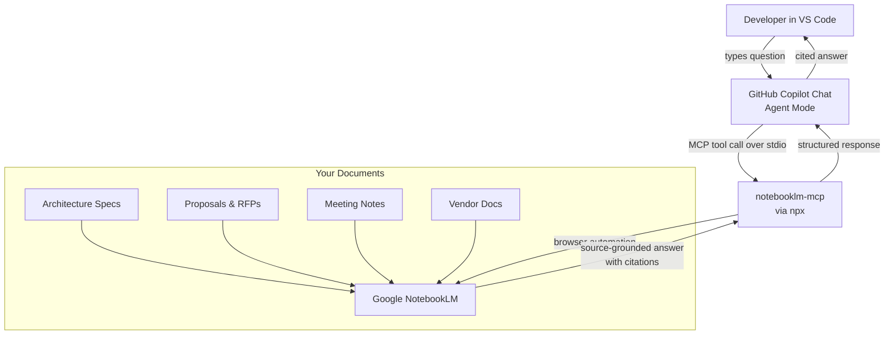

# NotebookLM + GitHub Copilot + MCP

> **GitHub Copilot + NotebookLM + MCP = grounded AI engineering inside VS Code.**

Turn GitHub Copilot into a source-grounded AI engineering agent using NotebookLM + MCP. Stop hallucinating architecture. Start citing documents.

[](https://github.com/davidop/notebooklm-github-copilot/stargazers)
[](https://github.com/davidop/notebooklm-github-copilot/network/members)
[](https://github.com/davidop/notebooklm-github-copilot/actions)
[](LICENSE)
[](https://modelcontextprotocol.io)
[](https://github.com/features/copilot)
[](https://notebooklm.google.com)

> **Unofficial community project.** Not affiliated with Google, GitHub, Microsoft, or OpenAI.
> A Claude Code Skills alternative for GitHub Copilot users.

---

**Other languages:** [Español](README.es.md)

---

## Why this exists

GitHub Copilot is excellent at writing code. It is not designed to reason over your private documents — customer proposals, architecture specs, meeting notes, vendor docs.

Claude Code Skills solves this for Anthropic users. This project solves the same problem for **GitHub Copilot** users, using **NotebookLM as the document intelligence layer** and **MCP as the integration protocol**.

The result: Copilot Chat can query your NotebookLM notebooks directly, ground answers in your sources, and cite them — all inside VS Code.

---

## Architecture



Other supported clients (OpenCode, Cursor) connect to the same `notebooklm-mcp` server using the same stdio transport. See [docs/mcp-clients.md](docs/mcp-clients.md) for a full comparison.

---

## What changed in v0.4

v0.4 evolves the toolkit from an enterprise reference kit into a demo-ready, easy-to-configure product that teams can try and adopt in minutes.

| Area | What's new |
|---|---|
| **Setup wizard** | `npm run setup:wizard` — generates MCP config for VS Code, OpenCode, Cursor or generic clients |
| **Config generator** | Non-interactive `npm run setup:vscode/opencode/cursor` commands |
| **Doctor command** | `npm run doctor` — checks Node.js, npm, Chrome, client configs and package scripts |
| **Demo kit** | 2-min, 5-min and 15-min scripts, sample outputs, recording checklist in `demo/` |
| **Integration recipes** | GitHub Issues and Azure DevOps prompt-driven workflows in `integrations/` |
| **Sample sources** | Fictional demo documents for NotebookLM in `sample-sources/` |
| **Output schemas** | JSON Schema 2020-12 definitions for ADRs, backlog, risk register and proposals |
| **Output format prompts** | Structured prompt packs in `prompt-packs/output-formats/` |
| **Adoption maturity model** | 5-level adoption framework in `docs/adoption-maturity-model.md` |
| **GitHub Pages site** | Static docs site in `site/` with `_config.yml` |
| **Improved validation** | `check:schemas`, `check:site` added to `check:repo` |

See [CHANGELOG.md](CHANGELOG.md) for the full list.

---

## What changed in v0.3

v0.3 adds enterprise rollout guidance, security hardening, governance templates, multi-notebook workflows, team prompt packs and an evaluation framework for source-grounded AI engineering.

| Area | What's new |
|---|---|
| **Security hardening** | Threat model, privacy guide, compliance considerations, browser profile security |
| **Governance** | Policy templates, approved sources policy, MCP server governance, team adoption playbook |
| **Multi-notebook workflows** | Query patterns across multiple notebooks, conflict resolution, source triangulation |
| **Team prompt packs** | Ready-to-use prompts for platform engineering, cloud architecture, presales, security, delivery and developer enablement |
| **Evaluation framework** | Scoring rubrics for architecture answers, presales outputs, code generation, and security reviews |
| **Security checklists** | Operational checklists for MCP server approval, source approval, browser profile management, and enterprise rollout |
| **Quality validation** | New scripts: `check:links`, `check:recipes`, `check:prompts`, `check:frontmatter`, `docs:index` |

See [CHANGELOG.md](CHANGELOG.md) for the full list.

---

## Try it in 5 minutes

**Prerequisites:** GitHub Copilot, VS Code, Node.js 18+, Chrome stable, Google account with NotebookLM access.

```bash
git clone https://github.com/davidop/notebooklm-github-copilot.git
cd notebooklm-github-copilot
npm install
npm run doctor          # check your environment
npm run setup:wizard    # generate VS Code / Cursor / OpenCode config
```

1. Open `.vscode/mcp.json` — click the **Start** CodeLens to launch the MCP server.
2. Open Copilot Chat → select **Agent** mode → enable `notebooklm` tools.
3. Authenticate once:
   ```
   Use the NotebookLM MCP server to run setup_auth. Open the browser visibly so I can log in.
   ```
4. Verify it works:
   ```
   Use NotebookLM to list my available notebooks and confirm whether I am authenticated.
   ```

See [docs/setup.md](docs/setup.md) for a complete setup walkthrough.

---

## Guided setup

The setup wizard generates MCP client configuration files without manual JSON editing:

```bash
npm run setup:wizard                                          # interactive
npm run setup:vscode                                          # VS Code / GitHub Copilot
npm run setup:opencode                                        # OpenCode
npm run setup:cursor                                          # Cursor
npm run setup:wizard -- --client vscode --version 0.1.0      # pinned version
npm run setup:wizard -- --client cursor --force               # overwrite existing
```

See [docs/setup-wizard.md](docs/setup-wizard.md) for full usage.

---

## Doctor command

Check your local environment before starting:

```bash
npm run doctor
```

Checks Node.js version, npm/npx, repository structure, client config files, package scripts and optional Chrome detection. Provides remediation suggestions for each issue.

See [docs/doctor.md](docs/doctor.md) for details.

---

## How it works

1. **MCP bridge** — `.vscode/mcp.json` wires VS Code to `notebooklm-mcp` via the Model Context Protocol stdio transport.
2. **Copilot instructions** — `.github/copilot-instructions.md` and `.github/instructions/` teach Copilot when and how to call NotebookLM tools.
3. **NotebookLM as RAG** — `notebooklm-mcp` drives a local Chrome session to query your notebooks, returning source-grounded answers with citations.
4. **Recipes and prompts** — Pre-built prompt patterns for ADRs, architecture reviews, presales, and more.

No documents leave your Google account. No NotebookLM code is vendored in this repo. The MCP server is managed by the `notebooklm-mcp` community package.

---

## Copilot + NotebookLM MCP vs Claude Code Skills

| Feature | This project | Claude Code Skills |
|---|---|---|
| **AI assistant** | GitHub Copilot | Claude Code |
| **Editor** | VS Code (any plan) | Terminal / any editor |
| **Document grounding** | NotebookLM via MCP | Anthropic RAG tools |
| **Source citations** | ✅ via NotebookLM | ✅ |
| **Notebook management** | Google NotebookLM UI | Custom |
| **Protocol** | MCP (stdio/HTTP) | Custom skill API |
| **Copilot Business/Enterprise** | ✅ (with org MCP policy) | ❌ |
| **Setup complexity** | Low (npx + Chrome) | Medium |
| **Offline use** | ❌ (requires Google) | Depends on setup |
| **Cost** | Copilot + NotebookLM plans | Claude subscription |

---

## Use cases

| Use case | What Copilot does |
|---|---|
| **Architecture Decision Records** | Queries prior decisions, generates ADR drafts grounded in your docs |
| **Presales proposals** | Reuses existing proposal language, cites past wins |
| **RFP analysis** | Extracts requirements, maps to capabilities from your knowledge base |
| **Azure architecture** | Generates Bicep/Terraform from vendor docs loaded into NotebookLM |
| **Meeting notes → backlog** | Turns action items from uploaded meeting notes into user stories |
| **Code from vendor docs** | Generates code aligned to vendor specifications in your notebooks |
| **Technical documentation** | Produces consistent docs by reusing your existing templates and style guides |

---

## Recipes

Step-by-step workflows for common engineering tasks:

| Recipe | Description |
|---|---|
| [Generate an ADR](recipes/generate-adr.md) | Create an Architecture Decision Record from prior decisions in NotebookLM |
| [Azure architecture](recipes/generate-azure-architecture.md) | Generate Azure architecture from vendor or customer docs |
| [Compare proposals](recipes/compare-proposals.md) | Compare two proposals against requirements |
| [Backlog from meeting notes](recipes/create-backlog-from-meeting.md) | Turn uploaded meeting notes into a sprint backlog |
| [Bicep from docs](recipes/generate-bicep-from-docs.md) | Generate Bicep templates grounded in architecture specs |
| [Terraform from docs](recipes/generate-terraform-from-docs.md) | Generate Terraform modules grounded in architecture specs |
| [Review an RFP](recipes/review-rfp.md) | Analyse an RFP against your capability library |

---

## GitHub and Azure DevOps integration recipes

Prompt-driven workflows for GitHub Issues and Azure DevOps:

**GitHub Issues:**

| Recipe | Description |
|---|---|
| [Create issues from NotebookLM](integrations/github/recipes/create-issues-from-notebooklm.md) | Turn NotebookLM outputs into GitHub Issues |
| [Triage issues with NotebookLM](integrations/github/recipes/triage-issues-with-notebooklm.md) | Ground issue triage in your knowledge base |
| [Generate PR description](integrations/github/recipes/generate-pr-description.md) | Generate grounded pull request descriptions |
| [Generate release notes](integrations/github/recipes/generate-release-notes.md) | Create release notes from NotebookLM sources |
| [ADR to GitHub Issues](integrations/github/recipes/adr-to-github-issues.md) | Convert ADRs into trackable GitHub Issues |

**Azure DevOps:**

| Recipe | Description |
|---|---|
| [Work items from meeting notes](integrations/azure-devops/recipes/create-work-items-from-meeting-notes.md) | Create work items from uploaded meeting notes |
| [Epics, features, user stories](integrations/azure-devops/recipes/epics-features-user-stories.md) | Generate backlog hierarchy from requirements |
| [Acceptance criteria](integrations/azure-devops/recipes/generate-acceptance-criteria.md) | Generate grounded acceptance criteria |
| [Sprint planning](integrations/azure-devops/recipes/sprint-planning-from-notebooklm.md) | Plan sprints using NotebookLM sources |
| [Delivery risk review](integrations/azure-devops/recipes/delivery-risk-review.md) | Review delivery risks with NotebookLM context |

---

## Demo kit

Everything you need to record a compelling demo without confidential data:

- [Demo README](demo/README.md) — Overview and setup assumptions
- [2-minute script](demo/demo-script-2-min.md) — Quick intro demo
- [5-minute script](demo/demo-script-5-min.md) — Standard team demo
- [15-minute script](demo/demo-script-15-min.md) — Deep-dive technical demo
- [Sample prompts](demo/sample-prompts.md) — Ready-to-paste prompts
- [Recording checklist](demo/recording-checklist.md) — Pre/during/post recording guide

---

## Sample sources

Fictional demo documents safe to upload to NotebookLM for demos:

> **Disclaimer:** These files are fictional demo sources and do not represent a real customer.

| File | Description |
|---|---|
| [cloud-modernization-brief.md](sample-sources/cloud-modernization-brief.md) | Fictional cloud modernization brief |
| [architecture-principles.md](sample-sources/architecture-principles.md) | Fictional architecture principles |
| [security-requirements.md](sample-sources/security-requirements.md) | Fictional security requirements |
| [customer-meeting-notes.md](sample-sources/customer-meeting-notes.md) | Fictional meeting notes |
| [vendor-implementation-guide.md](sample-sources/vendor-implementation-guide.md) | Fictional vendor guide |
| [previous-proposal-summary.md](sample-sources/previous-proposal-summary.md) | Fictional proposal summary |

---

## Output schemas

JSON Schema definitions for structured AI outputs:

| Schema | Description |
|---|---|
| [adr.schema.json](schemas/adr.schema.json) | Architecture Decision Record |
| [architecture-review.schema.json](schemas/architecture-review.schema.json) | Architecture review report |
| [backlog-items.schema.json](schemas/backlog-items.schema.json) | Sprint backlog items |
| [presales-proposal.schema.json](schemas/presales-proposal.schema.json) | Presales proposal |
| [risk-register.schema.json](schemas/risk-register.schema.json) | Risk register |

---

## Adoption maturity model

A five-level framework for adopting NotebookLM + MCP across teams:

| Level | Stage |
|---|---|
| 0 | Ad hoc local experiments |
| 1 | Individual developer setup |
| 2 | Team-shared prompts and recipes |
| 3 | Governed enterprise rollout |
| 4 | Evaluated and continuously improved workflows |

See [docs/adoption-maturity-model.md](docs/adoption-maturity-model.md) for the full model.

---

## GitHub Pages documentation

The `site/` folder contains a static documentation site compatible with GitHub Pages:

- [Getting started](site/getting-started.md)
- [Client configuration](site/clients.md)
- [Recipes overview](site/recipes.md)
- [Security](site/security.md)
- [Governance](site/governance.md)
- [FAQ](site/faq.md)

---

## Security and privacy

- **No secrets in NotebookLM.** Never upload API keys, credentials, connection strings, or regulated personal data to Google NotebookLM.
- **Authentication is local.** The MCP server stores a Chrome profile on your machine. It is not committed to this repository.
- **Google's data processing applies.** Documents uploaded to NotebookLM are subject to Google's terms of service and privacy policy.
- **Scope documents carefully.** Only upload documents your organization has approved for cloud storage and AI processing.

See [security/threat-model.md](security/threat-model.md) and [SECURITY.md](SECURITY.md) for full details.

---

## Enterprise rollout

For organizations deploying this to multiple developers:

1. **Enable MCP in Copilot policy** — Copilot Business/Enterprise requires explicit org policy for MCP servers.
2. **Pin the MCP server version** — Set a specific `notebooklm-mcp@x.y.z` in `.vscode/mcp.json` rather than `@latest`.
3. **Document approved notebooks** — Maintain an internal registry of approved NotebookLM notebooks per team.
4. **Train on data classification** — Ensure engineers know what is safe to upload.

See [docs/enterprise-rollout.md](docs/enterprise-rollout.md) for a full checklist.

---

## Security hardening

See dedicated documentation for security, privacy and compliance:

- [Security hardening guide](docs/security-hardening.md)
- [Privacy and data handling](docs/privacy-and-data-handling.md)
- [Compliance considerations](docs/compliance-considerations.md)
- [Browser profile security](docs/browser-profile-security.md)
- [MCP threat model](docs/mcp-threat-model.md)

---

## Governance templates

Generic, reusable policy templates for enterprise teams adopting AI-assisted engineering:

- [AI-assisted engineering policy](governance/ai-assisted-engineering-policy.md)
- [Approved sources policy](governance/approved-sources-policy.md)
- [NotebookLM usage policy](governance/notebooklm-usage-policy.md)
- [MCP server governance](governance/mcp-server-governance.md)
- [Team adoption playbook](governance/team-adoption-playbook.md)

See [governance/](governance/) for the full collection.

---

## Evaluation framework

Scoring rubrics and scenarios for reviewing the quality of AI-assisted engineering outputs:

- [Source grounding scorecard](evals/source-grounding-scorecard.md)
- [Architecture answer evaluation](evals/architecture-answer-evaluation.md)
- [Presales output evaluation](evals/presales-output-evaluation.md)
- [Code generation evaluation](evals/code-generation-from-docs-evaluation.md)

See [evals/](evals/) for all rubrics and scenarios.

---

## Multi-notebook workflows

Work with multiple specialized notebooks in a single workflow — combining customer requirements, internal standards, vendor docs, and prior proposals:

- [Multi-notebook workflows guide](docs/multi-notebook-workflows.md)
- [Multi-notebook research recipe](recipes/multi-notebook-research.md)
- [Source triangulation](recipes/source-triangulation.md)
- [Conflict resolution between sources](recipes/conflict-resolution-between-sources.md)

---

## Team prompt packs

Copy-paste-ready prompt collections for specific teams and roles:

| Team | Prompt pack |
|---|---|
| Platform engineering | [prompt-packs/team/platform-engineering.md](prompt-packs/team/platform-engineering.md) |
| Cloud architecture | [prompt-packs/team/cloud-architecture.md](prompt-packs/team/cloud-architecture.md) |
| Presales | [prompt-packs/team/presales.md](prompt-packs/team/presales.md) |
| Security | [prompt-packs/team/security.md](prompt-packs/team/security.md) |
| Delivery management | [prompt-packs/team/delivery-management.md](prompt-packs/team/delivery-management.md) |
| Developer enablement | [prompt-packs/team/developer-enablement.md](prompt-packs/team/developer-enablement.md) |

---

## Limitations

- **Browser automation fragility** — `notebooklm-mcp` uses browser automation against the NotebookLM UI. Google UI changes can break it until the package is updated.
- **No offline mode** — Requires an active Google session and internet connection.
- **Authentication is per-developer** — No centralized service account for NotebookLM (Google does not expose a public API).
- **NotebookLM source limits** — Notebooks have source count and size limits imposed by Google.
- **Codespaces caveat** — Interactive browser authentication works best from a local VS Code environment, not GitHub Codespaces.
- **Auditability gaps** — NotebookLM does not expose audit logs. Track notebook queries through your coding agent's conversation history.
- **No centralized policy enforcement** — Governance templates are advisory. Enforcement depends on organizational controls.
- **Evaluation framework is manual** — The evals/ rubrics require human reviewers. There is no automated grading.

---

## Disclaimer

This is an **unofficial community project**. It is not affiliated with, endorsed by, or supported by Google, GitHub, Microsoft, or OpenAI. Use it at your own risk.

The `notebooklm-mcp` server is a third-party package. Review its license and security posture before enterprise deployment.

---

## Repository layout

```text
.github/
  copilot-instructions.md
  instructions/
  workflows/
  ISSUE_TEMPLATE/
  PULL_REQUEST_TEMPLATE.md
.vscode/
  mcp.json
  settings.json
  extensions.json
.devcontainer/
  devcontainer.json
  README.md
assets/
  social-preview.svg
clients/
  vscode/
    mcp.json
    copilot-instructions.example.md
    README.md
  opencode/
    opencode.jsonc
    agent-researcher.md
    agent-architect.md
    agent-presales.md
    README.md
  cursor/
    mcp.json
    rules/
    README.md
docs/
  setup.md
  usage.md
  troubleshooting.md
  operating-model.md
  enterprise-rollout.md
  faq.md
  mcp-clients.md
  devcontainer.md
examples/
  prompts.md
  adr-from-notebooklm/
  architecture-review/
  presales-proposal/
  code-from-vendor-docs/
  meeting-notes-to-backlog/
prompts/
recipes/
security/
  threat-model.md
governance/
  README.md
  ai-assisted-engineering-policy.md
  approved-sources-policy.md
  notebooklm-usage-policy.md
  mcp-server-governance.md
  prompt-and-output-review-policy.md
  team-adoption-playbook.md
  exception-request-template.md
checklists/
  README.md
  security/
    mcp-server-approval-checklist.md
    notebooklm-source-approval-checklist.md
    customer-data-review-checklist.md
    browser-profile-checklist.md
    prompt-injection-review-checklist.md
    enterprise-rollout-security-checklist.md
evals/
  README.md
  source-grounding-scorecard.md
  architecture-answer-evaluation.md
  presales-output-evaluation.md
  code-generation-from-docs-evaluation.md
  security-review-evaluation.md
  rubric-template.md
  scenarios/
    adr-generation.md
    azure-architecture-review.md
    rfp-review.md
    security-threat-model.md
    code-from-vendor-docs.md
prompt-packs/
  README.md
  team/
    README.md
    platform-engineering.md
    cloud-architecture.md
    presales.md
    security.md
    delivery-management.md
    developer-enablement.md
  output-formats/
    README.md
    json-adr.md
    json-backlog.md
    json-risk-register.md
    markdown-executive-summary.md
    markdown-architecture-review.md
marketing/
  v0.3-launch.md
  v0.4-launch.md
integrations/
  github/
    README.md
    recipes/
  azure-devops/
    README.md
    recipes/
demo/
  README.md
  demo-script-2-min.md
  demo-script-5-min.md
  demo-script-15-min.md
  sample-prompts.md
  sample-notebook-sources.md
  recording-checklist.md
  sample-outputs/
site/
  index.md
  getting-started.md
  clients.md
  recipes.md
  security.md
  governance.md
  evaluations.md
  demo.md
  faq.md
sample-sources/
  README.md
  cloud-modernization-brief.md
  architecture-principles.md
  security-requirements.md
  customer-meeting-notes.md
  vendor-implementation-guide.md
  previous-proposal-summary.md
schemas/
  README.md
  adr.schema.json
  architecture-review.schema.json
  backlog-items.schema.json
  presales-proposal.schema.json
  risk-register.schema.json
  examples/
templates/
scripts/
  validate.mjs
  smoke-test.mjs
  setup-wizard.mjs
  generate-client-config.mjs
  doctor.mjs
  check-schemas.mjs
  check-site.mjs
  release-notes.mjs
_config.yml
CHANGELOG.md
CONTRIBUTING.md
ROADMAP.md
SECURITY.md
SUPPORT.md
README.es.md
package.json
```

---

## Recommended adoption path

**New users:**
1. Run `npm run doctor` to check your environment
2. Run `npm run setup:wizard` to generate your MCP config
3. Pick a recipe from [recipes/](recipes/) that matches your workflow
4. Review [docs/security-hardening.md](docs/security-hardening.md) before uploading documents

**Teams adopting for the first time:**
1. Read the [adoption maturity model](docs/adoption-maturity-model.md)
2. Read the [team adoption playbook](governance/team-adoption-playbook.md)
3. Complete the [enterprise rollout security checklist](checklists/security/enterprise-rollout-security-checklist.md)
4. Choose prompt packs from [prompt-packs/team/](prompt-packs/team/)
5. Use the [demo kit](demo/README.md) to onboard the team

**Enterprise / governed deployments:**
1. Adapt the [governance templates](governance/) to your organization
2. Complete the [MCP server approval checklist](checklists/security/mcp-server-approval-checklist.md)
3. Set up approved notebook registry per [approved-sources-policy.md](governance/approved-sources-policy.md)
4. Train developers on [privacy and data handling](docs/privacy-and-data-handling.md)
5. Establish evaluation cadence using [evals/](evals/)

---

## Contributing

See [CONTRIBUTING.md](CONTRIBUTING.md). All contributions welcome — especially new recipes and real-world examples.

## Changelog

See [CHANGELOG.md](CHANGELOG.md).

## Roadmap

See [ROADMAP.md](ROADMAP.md).

## License

MIT. See [LICENSE](LICENSE).
