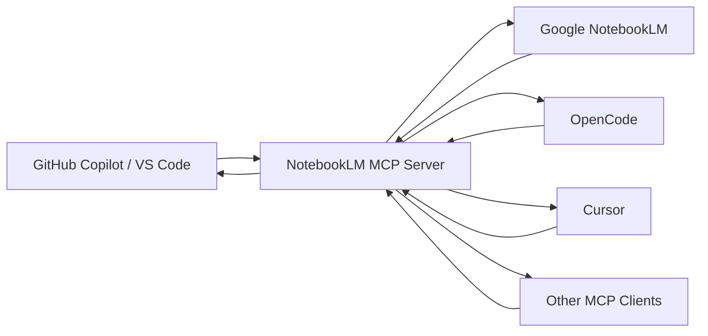

# MCP clients comparison

This document compares the supported MCP client integrations for the NotebookLM + MCP toolkit.

---

## Architecture



All supported clients connect to the same `notebooklm-mcp` server process via the **stdio MCP transport**. The server handles browser automation to query Google NotebookLM and returns grounded, cited answers.

---

## Client comparison table

| | GitHub Copilot (VS Code) | OpenCode | Cursor | Generic MCP client |
|---|---|---|---|---|
| **Config file** | `.vscode/mcp.json` | `~/.config/opencode/config.jsonc` | `.cursor/mcp.json` or `~/.cursor/mcp.json` | Varies by client |
| **MCP transport** | stdio | stdio | stdio | stdio or HTTP |
| **Agent / chat mode** | Copilot Chat (Agent mode) | OpenCode agent session | Cursor AI chat | Depends on client |
| **Recommended use cases** | VS Code-native workflows, code generation, ADRs | Terminal-first workflows, scripting, automation | In-editor chat, code generation from docs | CI pipelines, custom tooling |
| **Strengths** | Deep VS Code integration; repository instructions via `.github/`; Copilot Business/Enterprise policy support | Lightweight; fast terminal workflow; scriptable agent sessions | Cursor Rules for fine-grained control; strong code generation | Flexible; can integrate into any MCP-compatible tool |
| **Limitations** | Requires VS Code; Copilot plan required | Less mature MCP ecosystem than VS Code; terminal-only | Cursor-specific rules format; requires Cursor subscription | No standardized instruction/rules mechanism; integration varies |
| **Auth requirement** | GitHub Copilot + Google account | Google account (local Chrome) | Google account (local Chrome) | Google account (local Chrome) |
| **Offline support** | ❌ | ❌ | ❌ | ❌ |
| **Container support** | Editing only (no live MCP in headless) | Editing only | Editing only | Depends |

---

## GitHub Copilot in VS Code

**Config:** `.vscode/mcp.json`

**Strengths:**
- First-class integration with VS Code and GitHub Copilot.
- Repository instructions (`.github/copilot-instructions.md`) are automatically loaded by Copilot.
- Workspace-level config is easy to commit and share across a team.
- Compatible with Copilot Business and Enterprise (with org MCP policy enabled).
- CodeLens start/stop controls for the MCP server directly in the config file.

**Limitations:**
- Requires VS Code and a GitHub Copilot subscription.
- Browser authentication requires a local VS Code environment (not Codespaces).

**Setup:** See [clients/vscode/README.md](../clients/vscode/README.md)

---

## OpenCode

**Config:** `~/.config/opencode/config.jsonc`

**Strengths:**
- Terminal-first workflow, no editor required.
- Well-suited for scripting, automation, and CI-adjacent workflows.
- Simple JSONC configuration format.
- Supports custom agent personas via instruction files.

**Limitations:**
- Less mature MCP ecosystem compared to VS Code.
- No persistent repository-level instructions mechanism equivalent to `.github/copilot-instructions.md`.
- Requires a local terminal environment for browser authentication.

**Setup:** See [clients/opencode/README.md](../clients/opencode/README.md)

---

## Cursor

**Config:** `.cursor/mcp.json` (workspace) or `~/.cursor/mcp.json` (user)

**Strengths:**
- Strong in-editor AI chat and code generation.
- Cursor Rules (`.mdc` files) provide fine-grained, file-type-scoped instructions.
- Workspace-level config can be committed alongside project files.
- Flexible rule targeting via glob patterns.

**Limitations:**
- Requires a Cursor subscription.
- Rules format (`.mdc`) is Cursor-specific and not portable to other clients.
- Browser authentication requires a local Cursor environment.

**Setup:** See [clients/cursor/README.md](../clients/cursor/README.md)

---

## Generic MCP-compatible clients

Any MCP-compatible client can connect to `notebooklm-mcp` using the stdio transport.

**Configuration pattern:**

```json
{
  "mcpServers": {
    "notebooklm": {
      "command": "npx",
      "args": ["-y", "notebooklm-mcp@latest"],
      "env": {
        "NOTEBOOKLM_ACCOUNT": "work"
      }
    }
  }
}
```

**Strengths:**
- Any MCP-compatible tool can use this configuration.
- Useful for custom tooling, CI pipelines, or experimental agent frameworks.

**Limitations:**
- No standardized instruction or rules mechanism across clients.
- Integration quality varies significantly by client.
- Browser authentication still requires a local machine with Chrome.

---

## Choosing the right client

| Scenario | Recommended client |
|---|---|
| Day-to-day VS Code development | GitHub Copilot in VS Code |
| Terminal-first or scripting workflows | OpenCode |
| Cursor users wanting grounded code generation | Cursor |
| Custom tooling or CI integration | Generic MCP client |
| Presales or architecture documentation | Any — use the agent instruction files |

---

## Common limitations across all clients

- **Browser automation** — `notebooklm-mcp` uses local Chrome. Google UI changes can break it until the package is updated.
- **No offline mode** — NotebookLM is a cloud service.
- **Per-developer authentication** — No shared service account available.
- **NotebookLM source limits** — Google imposes notebook source count and size limits.
- **Not official integrations** — All configurations rely on the community `notebooklm-mcp` package.
